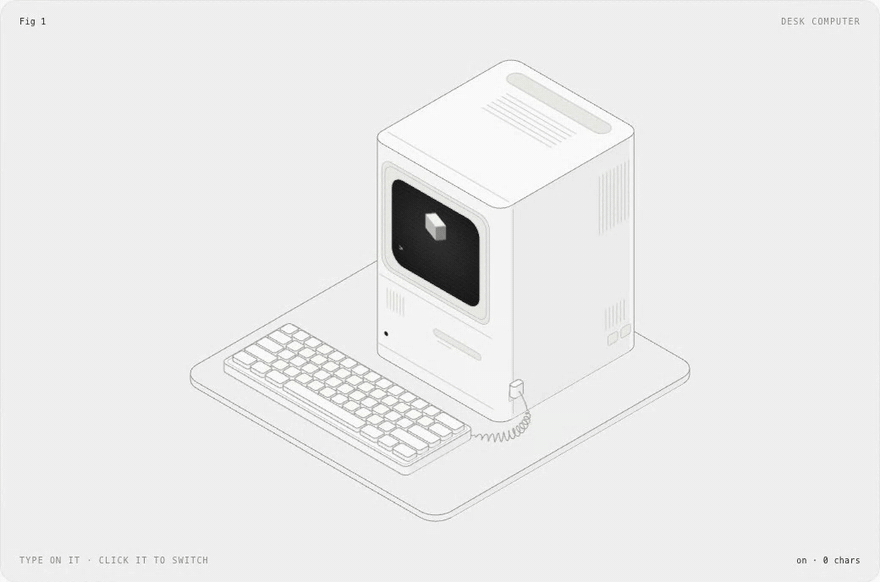
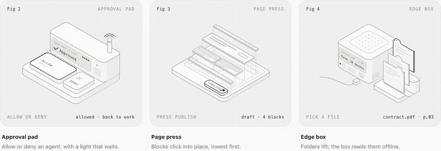

<div align="center">


# isokit

**Isometric figures you can press.**

Rounded boxes, faces you can draw on, keys that click back, and sound you can hear.<br />
A small, typed React kit, and a skill your coding agent uses to draw with it.

[](https://www.npmjs.com/package/react-isokit)
[](#performance)
[](#validation)
[](https://github.com/aadilghani1/isokit/actions/workflows/ci.yml)
[](LICENSE)
[](#the-skill)

[**Live demo**](https://aadilghani1.github.io/isokit/) · [Quick start](#quick-start) · [API](#api) · [With your agent](#with-your-agent-end-to-end)

<a href="https://aadilghani1.github.io/isokit/"></a>

</div>

## Why

Most product illustrations are pictures. These are objects: the key goes down when you press it and comes back up when you let go, the screen says what happened, and you can hear it. isokit gives you the few pieces that make that easy, so a figure is a list of boxes, not an afternoon in a design tool.

- **Real isometric.** True 30° projection, no perspective, no WebGL. Plain SVG that stays crisp at any size.
- **Draw on faces, not polygons.** Every face takes ordinary `<rect>`, `<path>` and `<text>` in its own flat coordinates. Screens, labels and vents land in projection for free.
- **Presses that feel physical.** Down on press, up on release, acts on release. Pointer, touch, Enter and Space.
- **Sound, done properly.** Twelve synthesized interaction sounds, no audio files, loaded only when someone reaches for a figure, silent until the page opts in.
- **Typed and validated.** Every public type is inferred from a zod schema. In development, bad input is explained in the console; in production it is clamped and costs nothing.
- **Light on the page.** 2.7 kB core, the sound engine is a separate 1.8 kB chunk, loops sleep offscreen, server rendering works.

## Quick start

```sh
npm i react-isokit
```

```tsx
import { useState } from "react"
import { Box, Plate, Press } from "react-isokit"
import "react-isokit/styles.css"

const key = { x: 0, y: 0, z: 0, w: 60, d: 60, h: 14 }

export function Key() {
  const [n, setN] = useState(0)
  return (
    <Plate label="A key you can press" fit={[key]} readout={`pressed ${n}×`}>
      <Press label="Press the key" onPress={() => setN(n + 1)}>
        <g><Box {...key} r={10} /></g>
      </Press>
    </Plate>
  )
}
```

That is a working, accessible, keyboard-operable key that sinks and springs back. Add `configureSound({ defaultOn: true })` once, and it clicks.

## How it works

**World space.** +x runs down-right, +y runs down-left, +z runs up, all 120° apart. A box is its back-left-bottom corner and its size: `{ x, y, z, w, d, h }`. Units are yours; `Plate` scales the result to fit.

**Paint order is depth.** There is no depth buffer: later shapes cover earlier ones. Emit back to front: smaller `x + y` first, lower `z` first, and for a grid, rows by `y` then columns by `x`.

**Faces are flat.** `Box` takes `top`, `front` and `side` children, each drawn in that face's own coordinates:

| Face | Faces toward | Local x | Local y | Origin |
| --- | --- | --- | --- | --- |
| `top` | up | along +x | along +y | back-left corner |
| `front` | lower-left | along +x | down | top-left corner |
| `side` | lower-right | front edge → back | down | top-front corner |

```tsx
<Box x={0} y={0} z={0} w={150} d={48} h={46} r={8}
  front={<>
    <rect className="ik-screen" x={9} y={8} width={106} height={30} rx={4} />
    <text className="ik-screen-text" x={15} y={30} fontSize={9.5}>Deploy preview?</text>
  </>}
/>
```

## API

### Components

#### `<Plate>`

The numbered plate a figure sits on, and the `<svg>` it is drawn in.

| Prop | Type | |
| --- | --- | --- |
| `label` | `string` | Required. The accessible name: what it is and how to use it. |
| `fit` | `Array<Box3 \| Vec3>` | Boxes and points to frame. Fit the most extreme pose your figure takes. |
| `aspect` | `number` | Width / height of the drawing. Default `1.25`. |
| `pad` | `number` | Padding around `fit`, as a share of its size. Default `0.07`. |
| `viewBox` | `string` | Your own viewBox instead of `fit`. |
| `fig`, `name`, `hint`, `readout` | `ReactNode` | The four corner captions. `readout` is announced to screen readers. |
| `theme` | `"light" \| "dark" \| "system"` | Unset follows a `.dark` or `[data-theme="dark"]` ancestor. |

Any other prop goes to the `<svg>`, so `data-*` attributes there can drive your CSS.

#### `<Box>`

A rounded box. Its outline is the hull of its rounded top and foot, so no vertical corner is drawn; its right side is tinted darker and its lid is lightest.

`x, y, z, w, d, h` (required), `r` (corner radius), `top`, `front`, `side` (drawn on that face), `className`, `children` (drawn after it).

#### `<Press>`

A part you can press. It goes down on press, comes up on release, and calls `onPress` on release. Wrap the boxes that should sink in one `<g>` inside it.

`label` (required), `onPress` (required), `sound` (default `true`), `disabled`, `className`. Add the class `ik-lift` for parts that lift instead of sinking.

#### Guided motion: `useDemoTap`, `<Cursor>`, `<Ripple>`, `<Signal>`, `<Flight>`

A first-time reader should see what to press and what pressing does. These five pieces do that; each has a page with a live example on the [components site](https://aadilghani1.github.io/isokit/#/components).

| Piece | |
| --- | --- |
| `useDemoTap(onTap, { delay, threshold })` | Presses the part marked `data-hot` once, silently, the first time the figure is mostly in view, then hands it over. Returns `{ ref, phase, dismiss, plate }`: `ref` on a group inside the svg, `plate` spread onto `Plate`, `phase` for `Cursor`. Cancelled by scrolling away before the press; never plays after the reader presses or types in the figure, under reduced motion, or without IntersectionObserver. |
| `<Cursor at phase size>` | The pointer the demo presses with, landing on a world point. Draw it last. |
| `<Ripple x y z w d r inFace>` | A ring breathing out from a footprint: the part to press. Show it until the first press. `inFace` draws it in the face it sits in, for keys on upright faces. |
| `<Signal points delay duration>` | A dash that runs once along world points, from the cause to the result. New `key` to run again. |
| `<Flight from to delay duration lift>` | Carries its children along an arc between two world points and hides them as they land. |

All five ignore the pointer, sleep offscreen and calm down under reduced motion. `delay` and `duration` are milliseconds; sound options are seconds.

#### `<SoundToggle>`

A small switch for interaction sound that remembers the reader's choice. Takes any `<button>` prop; its children replace the "Sound" label.

### Functions

| Function | |
| --- | --- |
| `frame(fit, aspect?, pad?)` | A viewBox around boxes and points. |
| `project(x, y, z)` | A world point on screen. |
| `top(x, y, z)`, `front(x, y, z)`, `side(x, y, z)` | SVG `transform` strings for drawing on a plane yourself. |
| `path(points)` | An open path through world points: cables, guides, wires. |
| `curve(a, b, c, d, steps?)` | Points along a cubic Bézier through four world points; draw them with `path`. |
| `outline(box, r)` | The outline path of a rounded box. |
| `corners(box)`, `hull(points)`, `radius(box, r)` | The geometry underneath. |

### Sound

| | |
| --- | --- |
| `configureSound({ defaultOn, storageKey, volume })` | Sound is **off** until the page turns it on. |
| `playSound(name, options?)` | Plays a sound if sound is on; returns a `stop()` for sounds a newer action should cut short. |
| `primeSound()` | Starts loading the engine. `Plate` calls it when a pointer or focus arrives. |
| `useSoundEnabled()` | `[on, setOn]`. |
| `soundPreference` | The store, shaped for `useSyncExternalStore`. |

### Validation

Every type isokit accepts is defined once, as a zod schema, and the TypeScript types are inferred from it. In development builds, `Plate`, `Box`, `frame`, `playSound` and `configureSound` check what they are given and explain any problem once in the console:

```
react-isokit: <Box x={0} y={0} z={0} w={-5} d={10} h={10}> cannot be drawn
✖ w cannot be negative
  → at w
```

Production builds skip the checks entirely, never load zod, and clamp bad input instead of breaking. To validate figure data you did not write yourself (JSON, a CMS, an agent's output), import the schemas:

```ts
import { box3Schema, describe } from "react-isokit/schema"

const result = box3Schema.safeParse(json)
if (!result.success) console.error(describe(result.error))
```

**The palette:** `press`, `release`, `toggle`, `boot`, `success`, `error`, `notify`, `complete`, `cascade`, `whoosh`, `paper`, `process`, `done`. `cascade` takes `{ count, stagger, delay }` so its steps land in time with your animation.

## Styling

Everything is drawn with a few classes and coloured by `--ik-*` custom properties, all at zero specificity, so your CSS always wins.

| Class | For |
| --- | --- |
| `ik-face`, `ik-top`, `ik-tint` | Solids (what `Box` uses). |
| `ik-detail` | Dim inner lines: seams, vents, text lines. |
| `ik-line` | Structure-weight lines: cables, rails. |
| `ik-live` | The one bright stroke: whatever is live right now. |
| `ik-dash` | Dotted construction guides. |
| `ik-well`, `ik-fill`, `ik-dot` | Recesses, solid marks, a bright dot. |
| `ik-screen`, `ik-screen-text`, `ik-screen-line` | Displays and what they show. |
| `ik-label` | Small engraved labels. Size them with CSS (`font-size`), not the `fontSize` attribute: CSS wins over SVG presentation attributes. |
| `ik-enter`, `ik-pulse`, `ik-blink`, `ik-float`, `ik-loop` | Ready-made motion; loops sleep offscreen. |

Restyle with `--ik-panel`, `--ik-top`, `--ik-front`, `--ik-side`, `--ik-well`, `--ik-line`, `--ik-detail`, `--ik-live`, `--ik-ink`, `--ik-ink-hi`, `--ik-screen`, `--ik-screen-ink`, `--ik-screen-font`, `--ik-border`, `--ik-ease` and `--ik-spring`.

## Performance

- **2.7 kB** for `Plate`, `Box`, `Press` and the math, 4.3 kB for the whole entry with guided motion, minified and brotlied; unused pieces tree-shake away. **2 kB** of CSS. Budgets are enforced in CI.
- **Validation costs nothing in production.** The schemas (zod/mini, 7.4 kB) load only in development builds, or when you import `react-isokit/schema` yourself.
- **Sound costs nothing until it is used.** The 1.8 kB engine is a separate chunk fetched when a pointer or focus reaches a plate; no `AudioContext` exists until the first press, and it is suspended again once the longest scheduled sound has finished and four quiet seconds have passed.
- **Loops sleep offscreen.** Each plate watches itself with one `IntersectionObserver`.
- **Server rendering.** Everything renders to static SVG; the package ships `"use client"` for the Next.js App Router.
- **Reduced motion** lands every transition at once and stops every loop.

## Accessibility

Every plate is a group named by your `label` (pass `role="img"` for a figure with nothing to press). Every `Press` is a focusable button with its own label; Enter and Space work like a real key, and focus shows as the live stroke. The read-out is a polite live region. Sound is never the only feedback.

## The skill

isokit ships a skill that teaches Claude Code (and Codex, Cursor and other agents that read skills) to draw interactive figures with it: decide what pressing produces, lay out the boxes, paint back to front, wire the presses and sounds, then screenshot and check its own work.

```sh
npx skills add aadilghani1/isokit
```

Or as a Claude Code plugin:

```
/plugin marketplace add aadilghani1/isokit
/plugin install isokit@isokit
```

From a shell: `claude plugin marketplace add aadilghani1/isokit` and `claude plugin install isokit@isokit`. Where else the skill is listed, and how, is in [docs/DISTRIBUTION.md](docs/DISTRIBUTION.md).

Then ask for a figure:

```
/isokit a kitchen timer with minute buttons and a display that counts down
```

## With your agent, end to end

1. **Teach your agent.** `npx skills add aadilghani1/isokit` (Claude Code, Codex, Cursor and any agent that reads skills).
2. **Add the kit.** `npm i react-isokit` and `import "react-isokit/styles.css"` once.
3. **Ask for a figure.** `/isokit a coffee grinder with a dial that sets the grind`. The skill decides what pressing produces, then lays out the boxes.
4. **It draws, looks and fixes.** Your agent writes the component, screenshots it in light and dark at desktop and phone width with the skill's checker, and fixes what it sees.
5. **Approve from your phone.** When your agent stops to install a package or start the dev server, [Pushary](https://pushary.com/?utm_source=isokit&utm_medium=referral&utm_campaign=readme) sends the question to your phone. Tap approve and it keeps working.

## Examples



The studio's figures are in [`examples/demo/src/figures`](examples/demo/src/figures), one folder per industry and one file per figure, at four levels of complication. Run them with `npm run dev`, browse the open briefs on the studio page, and start a new one with `npm run new:figure`.

## Made by the maker of Pushary

isokit is built by [Aadil Ghani](https://github.com/aadilghani1), who also makes **[Pushary](https://pushary.com/?utm_source=isokit&utm_medium=referral&utm_campaign=readme)**, the control panel for AI agents. Your agent froze, waiting for your yes: Pushary sends the question to your phone, Mac or Slack, and one tap puts it back to work. It works with Claude Code, Codex, Cursor, Windsurf, Gemini CLI and any MCP agent; `npx pushary@latest setup` connects them in under two minutes. The approval pad and the phone in the demo are drawn from it.

## Contributing

Issues and pull requests are welcome; see [CONTRIBUTING.md](CONTRIBUTING.md). Please keep to the [code of conduct](CODE_OF_CONDUCT.md).

## Credits

isokit stands on [Hairline](https://hairline.lucasmarkes.com) by Lucas Marques and [iso-figure](https://github.com/MrBongoC/ai-iso-skill) by Tolga Cohce, both MIT. See [NOTICE.md](NOTICE.md) for what came from where.

## License

[MIT](LICENSE) © [Aadil Ghani](https://github.com/aadilghani1)
